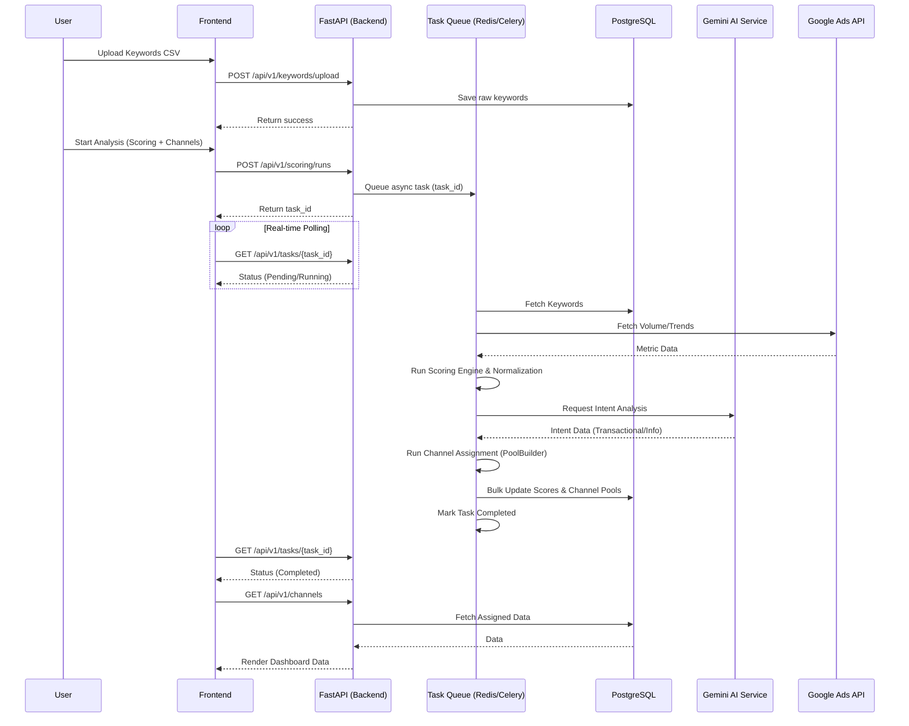
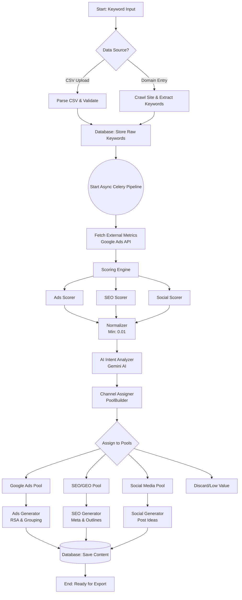

# System Design and Architecture: Digitus Engine

This document serves as the primary System Context reference for the Digitus Engine project. It provides a comprehensive overview of the system architecture, core business logic, optimal execution flows, deployment strategies, and coding guidelines.

---

## 1. System Overview

### Core Purpose
**Digitus Engine** is an AI-powered keyword analysis and channel assignment engine. Its primary goal is to process large sets of keywords, analyze them against various metrics, and intelligently assign them to specific marketing channels (Google Ads, SEO, Social Media) based on user intent and scoring. Additionally, the engine generates tailored, channel-specific content (e.g., SEO/GEO articles, Google Ads text suggestions, Social Media ideas) utilizing Google's Gemini AI.

### Core Tech Stack
*   **Backend:** FastAPI (Python) - Provides high-performance async RESTful APIs.
*   **Frontend:** React + TypeScript + Vite - Delivers a responsive, type-safe Single Page Application (SPA).
*   **Database:** PostgreSQL - Relational database for robust data persistence.
*   **ORM:** SQLAlchemy - Manages database interactions, utilizing `selectinload` for optimized relationships.
*   **Asynchronous Processing:** Celery + Redis - Handles long-running background tasks (scraping, AI generation, scoring).
*   **AI Integration:** Google Gemini AI (via `google.generativeai`) - Used for intent analysis and content generation.
*   **Containerization:** Docker & Docker Compose - Ensures consistent development and production environments.

---

## 2. Architecture Details

### Backend (`/app`)
The backend is structured modularly following clean architecture principles:
*   **`api/`**: Contains FastAPI routers, grouped by version (`v1/`) and resource (e.g., `keywords`, `scoring`, `channels`, `generation`, `export`, `tasks`).
*   **`core/`**: Houses the core business logic, including:
    *   `channel/`: Intent analysis and channel assignment logic (`intent_analyzer.py`, `pool_builder.py`).
    *   `scoring/`: Evaluates keywords for different channels (`ads_scorer.py`, `seo_scorer.py`, `social_scorer.py`, `score_engine.py`, `normalizer.py`).
    *   `site_analyzer/`: Logic for crawling and extracting profiles from target sites (`crawler.py`, `profile_extractor.py`, `relevance_scorer.py`).
    *   `security.py`, `logging_config.py`, `constants.py`.
*   **`database/`**: Database connection setup, SQLAlchemy `models.py`, and CRUD operations (often utilizing Repository Pattern).
*   **`generators/`**: AI content generation modules:
    *   `ads/`, `seo_geo/`, `social/`: Specialized generators for each channel.
    *   `ai_service.py`: Wraps the Gemini AI SDK (`GeminiService`), implementing LRU caching for performance and resilience.
*   **`integrations/`**: Third-party API integrations, notably Google Ads (`google_ads/service.py`, `google_ads/trend_calculator.py`).
*   **`schemas/`**: Pydantic models for request validation, response serialization, and type safety (e.g., `ads.py`, `keyword.py`, `scoring.py`).
*   **`tasks/`**: Celery asynchronous tasks (`celery_app.py`, `scoring_tasks.py`, `intent_tasks.py`, `generation_tasks.py`).
*   **`exporters/`**: Logic for generating downloadable reports (e.g., `docx_exporter.py` with modular rendering).

### Frontend (`/frontend`)
The frontend is a Vite-powered React application using TypeScript for strict type safety.
*   **`src/components/`**: Reusable UI components (e.g., `TaskProgress`, `ErrorBanner`, `SocialStepper`).
*   **`src/pages/`**: View components corresponding to major routes (`Dashboard`, `Keywords`, `Scoring`, `Channels`, `Generation`, `Export`).
*   **`src/services/`**: API client layer (`api.ts`) for communicating with the backend FastAPI application.
*   **`src/hooks/`**: Custom React hooks, such as `useTaskPolling.ts` for monitoring asynchronous Celery tasks.
*   **`src/stores/`**: State management (e.g., `socialStore.ts`).

### Asynchronous Task Management
Celery is central to Digitus Engine's ability to handle intensive workloads without blocking the API:
*   **Queueing:** Tasks like scoring (`scoring_tasks.py`), AI intent analysis (`intent_tasks.py`), and content generation (`generation_tasks.py`) are pushed to a Redis broker.
*   **Processing:** Celery workers pick up these tasks, execute them asynchronously, and update their status (Pending, Running, Completed, Failed) in the database or Redis.
*   **Frontend Monitoring:** The frontend uses a polling mechanism (`useTaskPolling.ts`) to request task status from the backend (`/api/v1/tasks/{task_id}`) and update progress bars in real-time.

### Database and ORM
*   **SQLAlchemy:** The primary ORM. It heavily utilizes `selectinload` for one-to-many relationships (e.g., `AdGroup.headlines`) to prevent N+1 query problems. It also leverages `bulk_insert_mappings` and batch `add_all()` patterns for high-performance data ingestion.
*   **Alembic:** Manages schema migrations (`/migrations`), ensuring the PostgreSQL database schema stays synchronized with the SQLAlchemy models.

---

## 3. Core Business Logic & Modules

### Site Analyzer
*   **`crawler.py` & `profile_extractor.py`**: These modules scan a target brand's website to extract its core profile, tone of voice, and key offerings. This profile provides context for the AI generators.
*   **`relevance_scorer.py`**: Determines how relevant specific keywords are to the extracted brand profile.

### Scoring Engine (`app/core/scoring/`)
Keywords are evaluated across three dimensions:
*   **Ads Scorer (`ads_scorer.py`)**: Evaluates commercial intent, CPC, and competition for Google Ads viability.
*   **SEO Scorer (`seo_scorer.py`)**: Evaluates search volume against keyword difficulty and competition.
*   **Social Scorer (`social_scorer.py`)**: Evaluates trend velocity and social engagement potential.
*   **Normalizer (`normalizer.py`)**: Ensures scores are comparable across channels. It enforces a minimum value of `0.01` to prevent mathematical errors and applies min-max scaling for values > 1.

### AI Generators (`app/generators/`)
The system transforms assigned keywords into tangible assets using Google Gemini:
*   **`prompt_templates.py`**: Stores structured, engineered prompts for the AI.
*   **`AdsGenerator`**: Generates RSA (Responsive Search Ads) headlines, descriptions, and keyword groupings.
*   **`SEOGeoGenerator`**: Produces SEO-optimized outlines, meta tags, and GEO (Generative Engine Optimization) content structures.
*   **`SocialGenerator`**: Creates social media post ideas, captions, and platform-specific recommendations.
*   **Resilience**: Generators use `try/except` blocks to return safe fallback dictionaries if the AI API fails, ensuring the pipeline continues running. They also utilize `ThreadPoolExecutor` to parallelize network-bound AI calls.

### Google Ads Integration
*   Communicates with the Google Ads API to fetch real-world search volumes, competition metrics, and trend data to feed the Scoring Engine.
*   Features a dedicated "Lab" environment (`app/integrations/google_ads_lab`) for isolated testing and probing without affecting production data.

---

## 4. Optimal Logical Execution & Data Flow

### The Complete Request Lifecycle

1.  **Ingestion**: User uploads a CSV of keywords or enters a domain via the React Frontend.
2.  **API Reception**: FastAPI receives the payload, validates it using Pydantic schemas, and saves initial records to PostgreSQL.
3.  **Task Delegation**: FastAPI triggers an asynchronous Celery task (e.g., `run_scoring_pipeline`) and immediately returns a `task_id` to the frontend.
4.  **Site Analysis (Optional)**: If a URL was provided, the Site Analyzer crawls the site to build a Brand Profile.
5.  **Scoring & Normalization**: The Celery worker fetches external data (e.g., Google Ads API), runs the Scoring Engine, normalizes the scores, and updates the database using bulk operations.
6.  **Intent Analysis**: The `IntentAnalyzer` queries Gemini AI to determine the search intent (informational, transactional, navigational) for the keywords.
7.  **Channel Assignment**: `PoolBuilder` evaluates the normalized scores and intents, assigning keywords to the optimal channels (`ChannelCandidate` table).
8.  **Content Generation**: Dedicated Celery tasks trigger the respective Generators (Ads, SEO, Social) for the assigned keywords.
9.  **Real-time Updates**: Concurrently, the frontend polls the `/tasks` endpoint. Once the task status is `completed`, the frontend fetches the final data.
10. **Export**: The user requests a download. The `ExportDataCollector` uses optimized `joinedload`/`selectinload` queries to fetch all data, and tools like `DocxExporter` generate the final file.

### Visual Architecture & Flow Diagrams

#### System Sequence Diagram

#### Logical Processing Flowchart

---

## 5. Deployment & Environment

### Docker Configuration
The application relies heavily on Docker Compose:
*   **`docker-compose.yml`**: Used for local development. Mounts local volumes for hot-reloading (`app` and `frontend`). Exposes ports for direct access.
*   **`docker-compose.prod.yml`**: Used for production deployment. Builds static images without volume mounting source code.
*   **Profiles**: Features specialized profiles, such as `site_fetch_smoke`, which can be run in isolation (`docker compose --profile smoke run ...`) to test specific components without spinning up the entire stack.

### Environment Variable Strategy
Configuration is managed via Pydantic `BaseSettings` (`app/config.py`):
*   Sensitive data (`SECRET_KEY`, `POSTGRES_PASSWORD`, `GEMINI_API_KEY`) **must** be provided via the `.env` file or environment variables.
*   **Production Security Validator**: If `APP_ENV` is set to `production`, `config.py` runs a strict validation check (`check_production_security`) that immediately halts the application if placeholder passwords (e.g., `digitus_secret_123`) or default secret keys are detected.

---

## 6. Design Patterns & Coding Guidelines

To maintain system integrity and performance, developers and AI agents must adhere to the following rules:

1.  **Avoid N+1 Query Problems**:
    *   For reading: Always use `selectinload` for one-to-many relationships, and `joinedload` for one-to-one relationships in SQLAlchemy.
    *   For writing: Always batch inserts using `Session.bulk_insert_mappings()` or `db.add_all()` followed by a single `db.commit()`. Do not loop and commit individually.
2.  **Type Safety First**: All API inputs and outputs must be strongly typed using Pydantic models in `app/schemas/`. Use strict TypeScript interfaces in the frontend.
3.  **Resilient External Calls**: Network calls (especially to Gemini AI and Google Ads) must be wrapped in `try/except` blocks. If an external service fails, the system should log the error and return a structured fallback response (e.g., a default dictionary) rather than crashing the pipeline.
4.  **Centralized Logging**: Use the `loguru` implementation configured in `app/core/logging_config.py`. Avoid using standard `print()` statements. Logs should be JSON formatted in production for easy parsing.
5.  **Global Exception Handling**: Let the global exception handler (`app/main.py`) catch unhandled HTTP exceptions to ensure consistent JSON error responses sent to the frontend.
6.  **Concurrency for I/O**: Utilize `concurrent.futures.ThreadPoolExecutor` when making multiple independent AI API calls within a single task to improve throughput.
7.  **Floating Point Safety**: When dealing with scores, normalize values and establish minimum thresholds (e.g., 0.01) to avoid division-by-zero errors in downstream calculations.
8.  **Test Driven**: Write unit tests in `/tests/unit` utilizing `pytest`. Always mock database sessions and external services for unit tests. Use `pytest.approx()` for floating-point assertions. Ensure `PYTHONPATH` is set correctly when running tests.